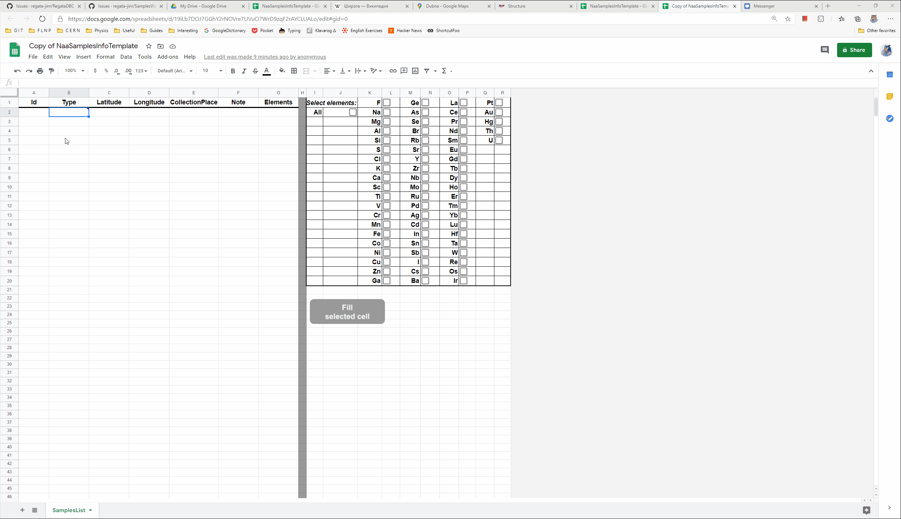
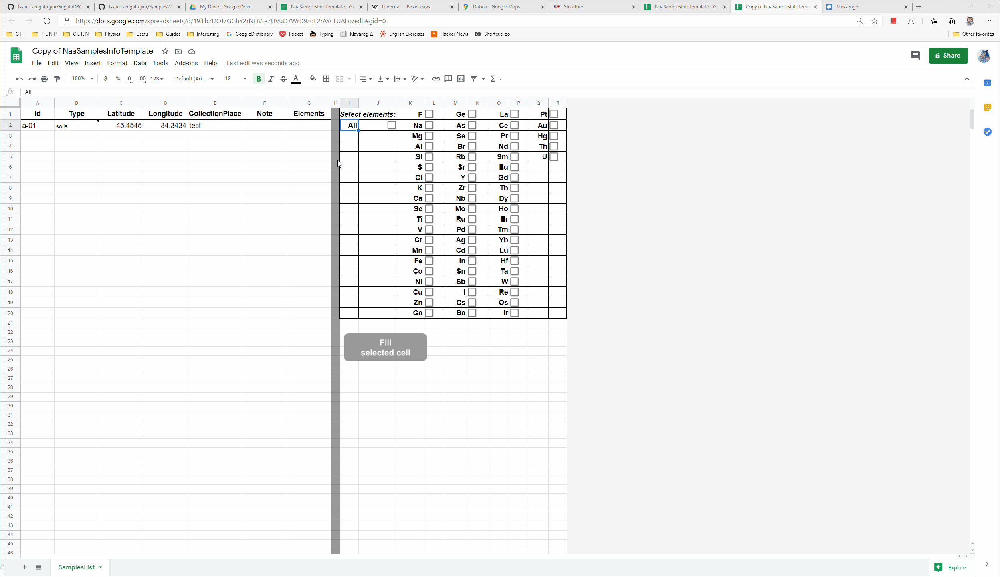
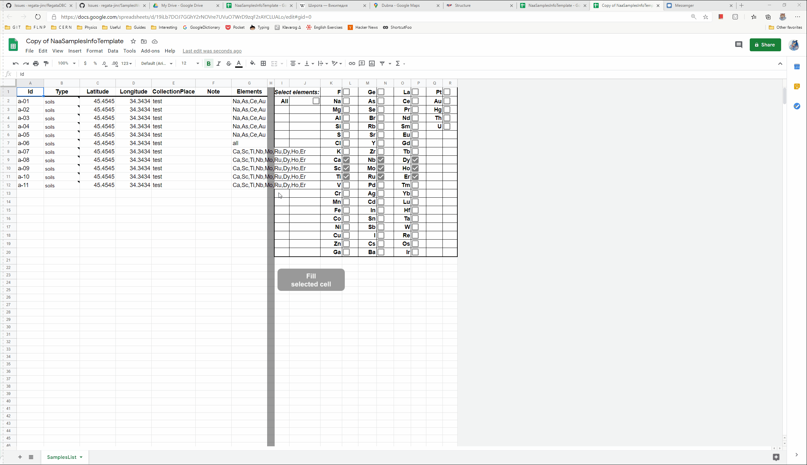
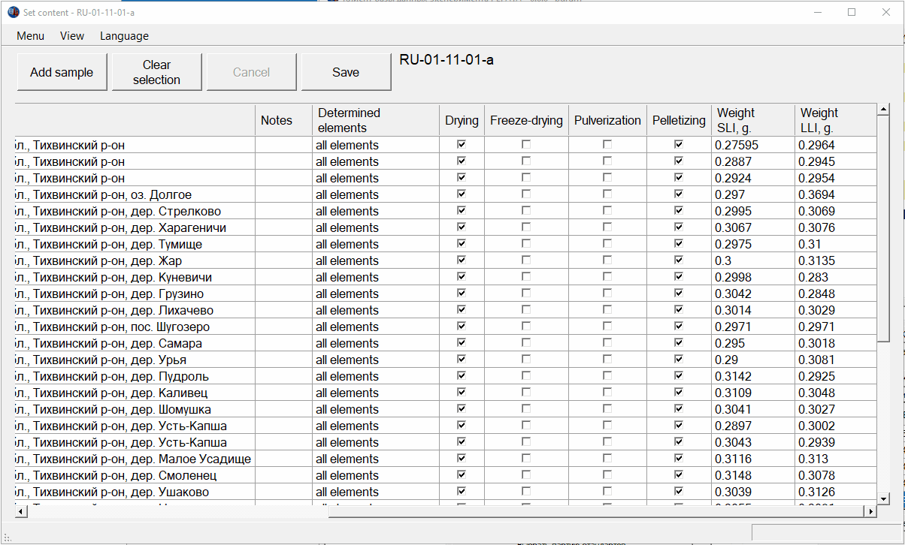



_Программа предназначена для доступа к данным, полученным в ходе экспериментов на установке ["Регата" ЛНФ, ОИЯИ](http://regata.jinr.ru/)._

## Вход в программу

Для входа в программу требуется иметь логин/пароль.

В случае, если Вы хотите получить доступ к БД Вам необходимо обратиться к начальнику сектора.
В случае, если Вы забыли пароль, Вам необходимо обратиться к администратору программы.

> **Пароли не хранятся в открытом виде. Поэтому, если Вы забыли пароль, его можно только поменять.**

Введенную пару Вы можете сохранить, для того чтобы избежать повторного введения. 
Если Вы хотите изменить введенные данные, Вы можете нажать кнопку Меню->Выйти.

### Обновление

Программа обновляется автоматически:

При входе в программу проверяется наличие новых версий, если такие найдены, программа автоматически откроет страницу с описанием новой версии, при этом, параллельно, новая версия будет скачана, установлена и запущена, а старая программа будет закрыта  и удалена с Вашего компьютера.

> **В случае возникновения ошибки при обновлении, вы можете в ручную скачать установочный файл и запустить его.**
 
> **Сделать это можно на [этой странице](https://github.com/regata-jinr/RegataDBC/releases/latest)**

### Права доступа и роли

Каждому пользователю назначена одна или несколько ролей.
Наличие роли указывает серверу базы данных на то, какие операции над какими данными разрешены пользователю.

Роли и права, которые они предоставляют:

* **Аналитик** - просмотр любых данных. Изменение данных результатов анализа. Проставление этапа окончания анализа партии.
* **Инспектор** - просмотр любых данных. Изменение данных связанных с партией и образцами, стандартами и мониторами.
* **Оператор** - просмотр любых данных. Изменение данных связанных с олучением и измерением образцов, стандартов и мониторов.
* **Лаборант** - просмотр любых данных. Изменение данных о пробоподготовке и взвешивании.
* **Перепаковщик** - просмотр любых данных. Изменение данных о перепаковке образцов, стандартов и эталонов.

## Главное окно

Главное окно программы представляет собой совокупность таблиц и кнопок, которые позволяют просматривать и изменять(при наличии необходимой роли) информацию об образцах, эталонах и мониторах.

### Информация о партии

Область помеченная цифрой 1 на скриншоте выше содержит основную информацию о партии.

### Список образцов

Нажав на конпку помеченную цифрой 2 откроется окно с информацией об образцах:

На вкладке 'Вид' Вы можете настроить отображение столбцов, которое будет сохранено и использовано в дальнейшем.
Так, например, если Вас не интересует информация о пробоподготовке, то Вы можете снять отметку об отображении соответствующих столбцов:

#### Загрузка спектров партии

В строке меню, Вы можете загрузить спектры всех образов партии:

Обращаю внимание на то, что при загрузке спектров КЖИ, в выбранной папке создается директория с именем партии, внутри которой создается директория с названием типа и внутри этой директории будут созданы еще две директории с спектрами образцов и эталонов:

~~~powershell
VN-07-20-12-l:
└───SLI
    ├───Sample
    └───SRM
~~~

> **При загрузке спектров КЖИ скачиваются все спектры эталонов, которые облучались в реакторном цикле с выбранной партией.**

Для ДЖИ все тоже самое, только после типа добавляется директория с номером загрузки и разбивка по контейнерам:

~~~powershell
VN-02-18-56-d
├───LLI-1
│   └───192
│       ├───c-1
│       │   ├───Sample
│       │   └───SRM
│       ├───c-2
│       │   ├───Sample
│       │   └───SRM
│       ├───c-3
│       │   ├───Sample
│       │   └───SRM
│       ├───c-4
│       │   ├───Sample
│       │   └───SRM
│       └───c-5
│           ├───Sample
│           └───SRM
~~~

> **При загрузке спектров ДЖИ скачиваются все спектры эталонов, которые облучались в той же загрузке и тех же контейнерах, что образцы выбранной партии**

### Импортирование списка образцов из Google Sheets

Для создания списка образцов, для последующего импорта в базу данных, мы предлагаем пользоваться электронными таблицами [Google Sheets](https://www.google.com/sheets/about/). Такие таблицы позволяют не только облегчить введение повторяющейся информации и нумерование списка, но и внедрить специфические требования к некоторым полям.

Для внесения Вам потребуется указать следующие параметры для каждого образца:

* **Id** - уникальный идентификатор, по которому Вы будете различать свои образцы. Внутри нашей базы данных мы присваиваем собственный идентификатор каждому образцу. Например, _Samp01_
* **Type** - тип образца. Например, _soils_, _sediments_, _rocks_. Тип до внесения, желательно, согласовать с сотрудником сектора.
* **Latitude** - широта, на которой был получен образец. Для сохранения единого формата вводить широту нужно в формате [<->00.000000], то есть количество символов не должно превышать 9 с учетом необязательного знака минус и разделителя разряда - точку. Например, _56.733333._
* **Longitude** - долгота, на которой был получен образец. Для сохранения единого формата вводить широту нужно в формате [<->00.000000], то есть количество символов не должно превышать 9 с учетом необязательного знака минус и разделителя разряда - точку. Например, _37.166667._
* **CollectionPlace** - место сбора. Кратко укажите место, в котором был получен образец. Например, _Dubna_
* **Note** - В это поле Вы можете внести комментарии касающиеся конкретного образца. Например, _control_
* **Elements** - список элементов, концентрации которых необходимо определить в данном образце. В случае всех определяемых - _all_, в случае конкретных, перечислите их через запятую: _Na, F, Ca_.

#### Использование шаблона для заполнения

Для того, чтобы облегчить процедуру внесения мы подготовили [шаблон документа](https://docs.google.com/spreadsheets/d/1QWgYP694uad09Mac9AjvtSFWhUaJCALIWPc0pK9oYVc/edit?usp=sharing), который представляет собой электронную таблицу с открытым доступом по ссылке, доступным только для чтения.

> **Если у Вас есть доступ к базе данных НАА через программу-клиент RegataDB вы можете скопировать ссылку прямо в буфер обмена из окна с информацией об образцах нажав на кнопку Меню->Копировать ссылку на шаблон для заполнения в GoogleSheet. После этого перейдите в бразуер и вставьте ссылку в строку введения веб адреса, например через ctrl+v или контекстное меню, которое открывается нажатие правой кнопки мыши.**

Он содержит предупреждения и дополнительные возможности для удобного внесения элементов.

**Для работы с файлом шаблона прежде всего необходимо иметь [аккаунт Google](https://www.google.com/account/about/).**

Если у Вас нет аккаунта Google Вы можете его создать.

**Если Вы не хотите создавать аккаунт Google, пожалуйста, обратитесь к сотруднику сектора, который курирует Ваши образцы.**

Итак, если у Вас есть аккаунт Google, для работы с шаблоном Вам необходимо:

1. Создать локальную копию шаблона у себя на диске Google. Сделать это можно следующим образом. При первом открытии таблица с шаблоном будет выглядеть так, как показано на скриншоте ниже:

Для того, чтобы создать личную копию шаблона, необходимо перейти в меню File->Make a copy:

После этого шаблон будет копирован на Ваш личный Google диск. Обратите внимание, Вы можете назначить новое имя файлу, а также выбрать директорию для хранения на Вашем Google диске.

После копирования автоматически откроется новая таблица на этот раз доступная для редактирования.

> _Для реализации вспомогательных возможностей мы использовали инструменты[Google Scripts](https://www.google.com/script/start/). Для их инициализации нужно некоторое время. Поэтому сразу после открытия документа, через сравнительно небольшое время (секунд 10) откроется окно с описанием возможностей шаблона._

Шаблон поможет Вам вносить информацию об образцах:

Покажет всплывающую подсказку на поле Type:

Выдаст ошибку с описанием в случае, если введенная координата не совпадает с форматом описанным выше:

2. Заполнение элементов и политика безопасности Google.

Функция автоматического заполнения элементов работает следующим образом:

1. Необходимо отметить элементы, которые Вы хотите добавить.
2. Выделить ячейку в столбце "Elements" соответствующую образцу, к которому Вы хотите добавить выбранные элементы для определения.
3. Нажать на кнопку **Fill selected cell**

> **В случае самого первого заполнения, но всегда после создания локальной копии, будет возникать сообщение о локальной политике безопасности Google. Для того, чтобы не видеть это сообщения в качестве шаблона используйте уже существущий файл на Вашем диске. Сотрите заполненные поля и заполняйте его заново. В этом случае сообщений о безопасности не будет.**

После того, как Вы заполнили локальный файл шаблона. Его необходимо отправить на проверку сотруднику сектора, который курирует Ваши образцы. Для этого необходимо:

1. Сделать файл доступным по ссылке

2. Отправить ссылку на проверку

#### Внесение образцов в базу данных

> **Для внесения образцов в БД необходимо наличие роли Инспектор**

Итак, после того, как у Вас есть заполненный файл GoogleSheets с открытым доступом по ссылке, Вам необходимо для той партии, в которую Вы хотите вставить образцы, открыть форму с информацией об образцах, затем перейти в меню->импорт из GoogleSheets. Вставить Вашу ссылку, нажать ОК и убедиться, что вся информация занесена корректна. После чего нажать на кнопку "Сохранить":

#### Заполнение полей пробоподготовки

Для того, чтобы не отмечать галочки пробоподготовки по одной, можно воспользоваться неявным функционалом:

При двойном клике на заголовок столбца соответствующего этапу пробоподготовки он будет инвертирован. То есть если в нем все образцы не были отмечены, все станут помечены. Если все были отмечены, все станут не помечены. Если часть была отмечена, а часть нет, то та часть, которая была отмечена, станет не отмечена и наоборот.

Кроме того, можно выделить ячейки, которые необходимо отметить и два раза кликнуть на любом из столбцов пробоподготовки, что также приведет к инвертации выделенных значений:

### Фильтрация партий

> **При первой загрузке программы, завершенные партии не отображаются. Для того, чтобы отобразить все партии необходимо нажать кнопку 'Сбросить фильтры'**

> **Для поиска партий создана система _вложенных_ фильтров.**
> **Это означает, что _каждый_ добавленный фильтр из области отмеченной цифрой 3 фильтрует множество партий отобранных предыдущим фильтром.**

### Комментарии

Для того, чтобы хранить информацию о каких-то проблемах связанных с обработкой, потерей образцов или информацию, которая связана с образцами существует функционал комментирования партии. Кнопка помеченная цифрой 4. Добавленный комментарий отображается в мониторе партии (область 1).

Помимо внесения разного рода информации, окно комментариев используется для пометке окончания одного из 4 этапов:

* Пробоподготовки
* Облучения КЖИ
* Облучения ДЖИ
* **Обработки**

Так, например, если Вы знаете, что несколько образцов не облучалось, а Вы закончили обрабатывать партию и согласовали все необходимые моменты с руководством, Вы можете проставить этап окончания обработки партии.
Для этого необходимо нажать на кнопку 'Комментарии' и открывшемся окне

Проставить необходимую галочку (если Вы аналитик, Вы можете завершить только этап обработки) и **подробно описать причину, почему Вы завершаете этап. Это важно, так как потом легко восстановить хронологию событий и не гадать о причинах закрытия.**

Также Вы можете снять уже отмеченную галочку, предварительно указав причину.

> **Отметка 'Окончание этапа пробоподготовки' помечает партию зеленым цветом. Это означает, что при первом открытии она не будет показываться в списке партий. Для её отображения необходимо нажать кнопку 'Сбросить фильтры'**

### Просмотр результатов анализа партии

Результаты обработки партии можно посмотреть/загрузить в окне 'Результаты НАА', которое открывается при нажатии на кнопку помеченную цифрой 5:

#### Экспортирование данных

Загрузить данные в базу возможно только из excel документов следующих видов:

1. Финальная таблица результатов сгенерированная [последней версией программы расчета концентраций](https://github.com/regata-jinr/CalcConc/releases/latest)

2. Финальный отчет полученный из окна результатов.

### Подготовка списка партий к печати

В программе реализована возможность управления списком партий в зависимсоти от статуса партий.
Существует 6 статусов, каждому из которых в соответствие проставлен цвет:

* Партия принята - проставляется партии автоматически, как только она принята.
* Проведена пробоподготовка - проставляется партии в ручную, после завершения этапа пробоподготовки.
* Облучение КЖИ - проставляется как только хотя бы один образец имеет дату облучения КЖИ
* Облучение ДЖИ - проставляется как только хотя бы один образец имеет дату облучения ДЖИ
* КЖИ ИЛИ ДЖИ и результаты - проставляется как только хотя бы один образец имеет дату облучения КЖИ или ДЖИ и в результатах у хотя бы одного образца появляется номер файла спектра
* КЖИ И ДЖИ И результаты - проставляется как только хотя бы один образец имеет даты облучения КЖИ и ДЖИ и в результатах у хотя бы одного образца появляется номер файла спектра

Кроме того, при выборе партии из списка, в описываемой таблице проставляется количество образцов находящихся на каждом этапе:

Нажатие на один из цветов соответствует выбору статуса для отображения. То есть, в главном списке партий будут отображены партии только с выбранным статусом. Это может помочь для списка партий на облучение.

### Журналы облучений

Журнал облучений представляет собой список образцов содержащий также информацию об облучении и измерении образца. Журналы для КЖИ и ДЖИ показываются отдельно.

#### Загрузка выбранных спектров

Через журнал облучений (как КЖИ так и ДЖИ) можно загрузить выбранные спектры. Такие спектры будут загружены прямо в выбранную папку без всякого деления. Для того чтобы это сделать, необходимо выделить спектры, которые Вы хотите загрузить, и нажать кнопку 'Сохранить спектры' (1 на картинке выше)

#### Распределение образцов по детекторам

Журнал измерений ДЖИ позволяет в автоматическом режиме подготовить списки контейнеров с образцами для выбранных детекторов. Для этого необходимо в журнале нажать на кнопку 'Образцы на детекторах'.

В этом случае откроется окно, работа с которым показано на картинке ниже:

